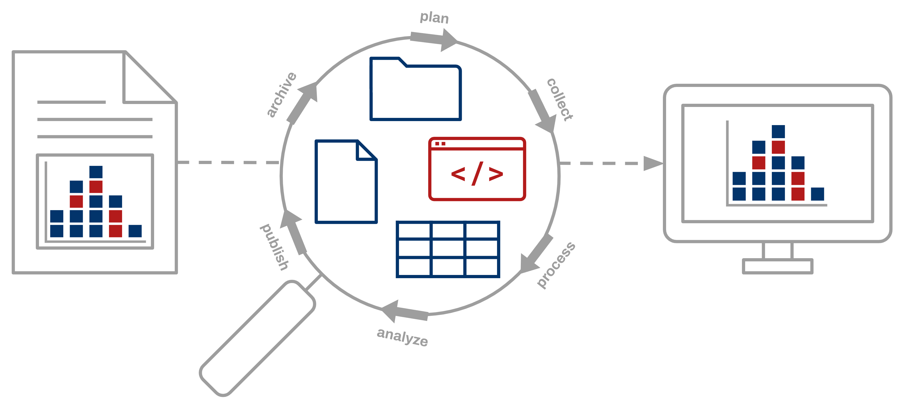

**CURE is more than data curation.** The object of curation in the context of reproducibility is the evidence-base for the scientific claim.  This requires consideration of not only the artifacts that underlie reported findings, but also the research workflows that led to the creation of those artifacts that produced the the findings.

**CURE applies curation actions to the entire research compendium.** The research compendium is a file bundle that contains the data, code, documentation, and all other materials needed to repeat the computational workflow to produce results identical to those presented in the published article without the need to request additional information from the author.

**CURE demands a series of rigorous curation activities.** CURE practices can ensure that the research compendium and its component objects align with prevailing prevailing community standards for digital archiving and preservation and support the FAIR principles to create a complete and reproducible scholarly record.  CURE is based on the [Data Quality Review Framework](/dqr), which describes a comprehensive set of curation actions not only for file, document, and data review, but also for code review.
