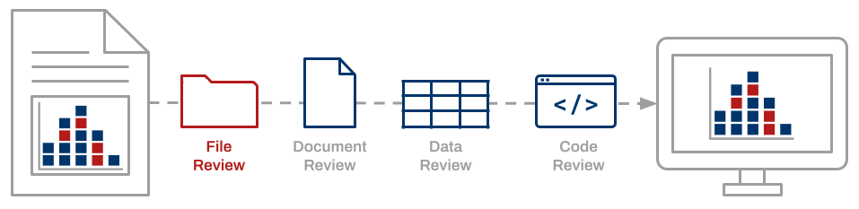
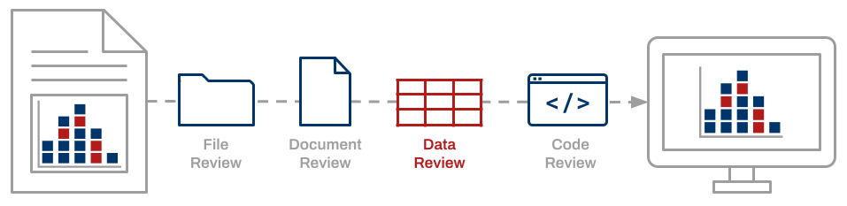
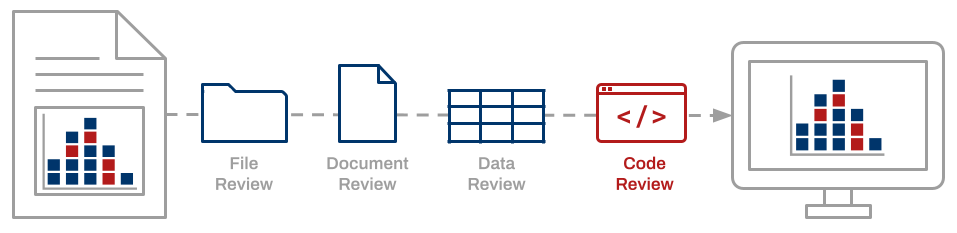

Empirical claims reported in a scientific journal typically rest upon data, software, code, documentation, and other digital artifacts that together constitute a “research compendium” ([Gentleman  & Lang, 2004](https://biostats.bepress.com/bioconductor/paper2)). The ability to independently reproduce scientific findings based on computational methods as reported by the original author is imperative ([NASEM, 2019](https://doi.org/10.17226/25303)). It allows confirmation of the research processes described by the original author and verification of the findings presented in the scientific publication. Enabling reproducibility over time requires proper curation of the research compendium.

> __"A data quality review is a process whereby data and associated files are assessed and required actions are taken to ensure files are independently understandable for informed reuse. This is an active process, involving a review of the files, the documentation, the data, and the code. We strongly believe that data quality cannot be realized without a data quality review” ([Peer, Green, & Stephenson, 2014](https://doi.org/10.2218/ijdc.v9i1.317)).__

The Data Quality Review framework defines a comprehensive set of curation actions to be applied to  compendium artifacts while considering the research context in which they were produced.



__An inspection of the research compendium and its contents ensures that the compendium includes all files necessary to re-execute the computational workflow.__

- Assign a unique, persistent identifer to the compendium.
- Check that all required files are present.
- Open files to ensure they render properly.
- Verify that file content matches expected content.
- Generate non-proprietary, software-agnostic file derivates (as needed).
- Establish a migration strategy for long-term preservation of file formats (as needed).





__Documentation must be sufficient enough that an individual other than the original investigator can understand and repeat the analytical workflow.__

- Confirm that the README file contains a complete list of compendium files. 
- Compare the data dictionary/codebook to its correponding dataset to ensure that all variables and values are defined.
- Verify that documentation includes all necessary information to re-execute the computational workflow.




__A close examination of data files is necessary for identifying and addressing undefined, missing, or flawed data as well as issues of confidentiality or copyright.__

- Compare the dataset with its corresponding data dictionary/codebook to check for undefined or missing variables.
- Inspect data values for wild or out-of-range codes.
- Look for the presence of personally identifiable information, protected health information, or another information that presents disclosure risks.





__Confirmation of the computational reproducibility of reported findings requires inspection and successful execution of the analysis code.__

- Confirm that the code includes scripts for loading necessary packages. 
- Review the code for the presence of non-executable code comments that explain the function of scripts and correspondence to manuscript tables and figures.
- Compile and run the code to verify error-free execution.
- Compare code outputs to results presented in tables, figures, and in-line text.


